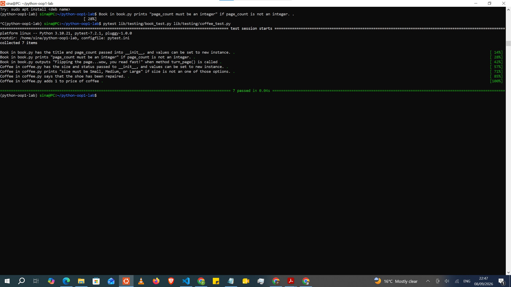

# Python OOP Lab: Bookstore

## Description
This project models a small bookstore using Object-Oriented Programming in Python.
It includes two classes:

- **Book** — represents a book with a `title` and `page_count`. The `page_count`
  is validated to ensure it's always an integer; if not, it prints
  `"page_count must be an integer"`. Calling `turn_page()` prints
  `"Flipping the page...wow, you read fast!"`.
- **Coffee** — represents a coffee item with a `size` and `price`. The `size` is
  validated to ensure it's one of `"Small"`, `"Medium"`, or `"Large"`; if not, it
  prints `"size must be Small, Medium, or Large"`. Calling `tip()` prints a
  thank-you message and increases the price by 1.

This lab was built as part of the Object Oriented Programming module, practicing
class definitions, `__init__`, property validation with getters/setters, and
instance methods.

## Installation
1. Clone this repository:
```bash
   git clone https://github.com/ndungupatriciawanjiru-hub0/python-oop1-lab.git
   cd python-oop1-lab
```
2. Install dependencies with [pipenv](https://pipenv.pypa.io/):
```bash
   pipenv install
   pipenv shell
```

## Usage
Run the test suite to see the classes in action and confirm everything works:

```bash
pytest lib/testing/book_test.py
pytest lib/testing/coffee_test.py
```

Example of using the classes directly:

```python
from book import Book
from coffee import Coffee

my_book = Book("And Then There Were None", 272)
my_book.turn_page()  # Flipping the page...wow, you read fast!

my_coffee = Coffee("Large", 3.50)
my_coffee.tip()  # This coffee is great, here's a tip! -> price becomes 4.50
```

## Screenshot


## Support
For questions about this lab, open an issue on this repository.

## Contributing
This is a solo lab submission, so pull requests aren't expected. That said,
feedback or suggestions are welcome via an issue.

## Authors and acknowledgment
Patricia Wanjiru Ndungu

## License
See [LICENSE.md](LICENSE.md) for details.

## Project status
Complete — all tests passing.